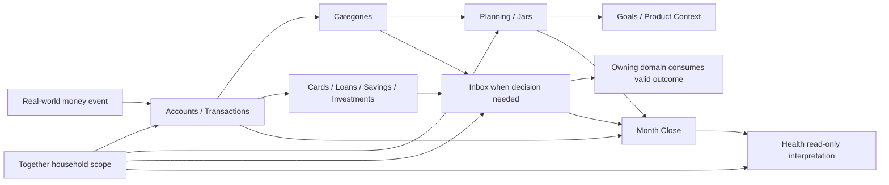

# System Overview

## Operating Model

ViNha operates on four distinct layers:

1. Real money truth: Accounts, Transactions, Cards, Loans, Savings, and Investments record where money is, how it moves, and what product or obligation it belongs to.
2. Meaning and intention: Categories, Planning, and Goals explain what money means and what the household intends.
3. Human decision routing: Inbox carries only decision-bearing attention from source domains.
4. Household interpretation: Together scopes visibility and participation; Health reads source facts and computes non-mutating interpretation.

## Domain Responsibility Map

| Domain | Owns | Must Not Own |
| --- | --- | --- |
| Accounts | Real containers, recorded positions, status, liquidity context | Transactions, jars, goals, card limits as money |
| Transactions | Immutable real movement, transfers, income, expenses, refunds, corrections | Product lifecycle, planning capacity, Health mutation |
| Categories | Household classification and category-to-jar meaning | Money, balances, caps, provider-certified truth |
| Cards | Card obligations, statements, due dates, repayment interpretation | Cash balance, automatic repayment, loan amortization |
| Loans | Scheduled borrowing obligations, repayment progress, payoff meaning | Card revolving balance, jars, automatic repayment |
| Savings | Product lifecycle, maturity, renewal, withdrawal, settlement | Goal balance, jar capacity, expected interest as cash |
| Investments | Holding identity, estimated value, realized/unrealized interpretation | Cash posting, trading advice, goal completion |
| Planning | Income expectations, jars, allocations, recurring expectations, month review | Real money movement, paid status, provider truth |
| Goals | Purpose, target, perceived progress, completion intention | Real balances, product truth, proof of purchase |
| Inbox | Typed review item lifecycle and decision history | Source truth, generic notifications, money movement |
| Together | Household scope, membership, visibility, policy context | Money movement, legal family registry, relationship adjudication |
| Health | Read-only condition, factors, completeness, scenarios | Any operational write, financial event creation, advice execution |

## System Spine

The operating spine is:

## Cohesion Finding

The source documentation uses compatible ownership language across domains. No domain claims another domain's source truth as its own. The main integration gap is not conceptual contradiction; it is the need to implement the handshakes with typed events and contract tests.

