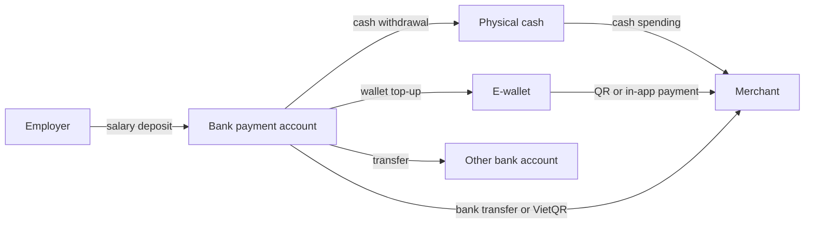
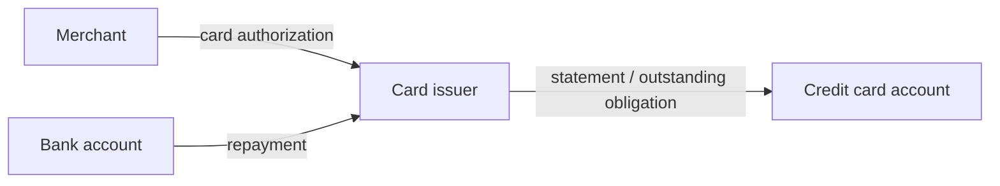
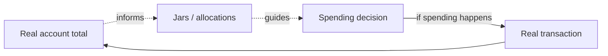
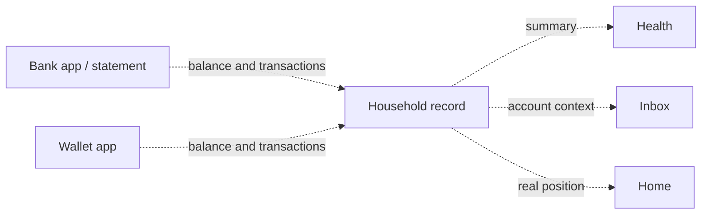

# Money Flow

## Real Money

Real money movement changes a real-world container.

## Virtual Planning

Virtual planning does not move real money. It assigns intention to money that still lives in accounts.

## Read-Only Information

Read-only flows mirror external facts but do not move money.

## Key Observations

- Real money movement occurs outside the product unless the product is explicitly integrated with payment rails.
- Account records can describe or reflect money movement without legally executing it.
- Transfers between owned accounts move real money but do not change household net worth.
- Planning allocations are virtual and should not be confused with account movement.
- Read-only imported data may be delayed, partial, duplicated, or stale.

