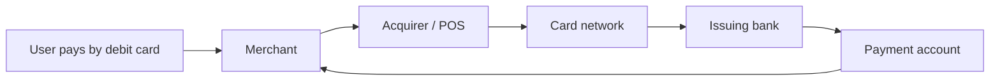
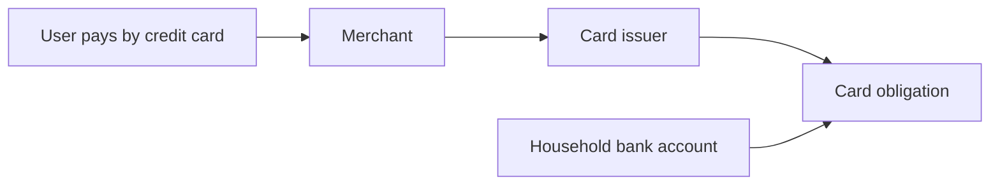
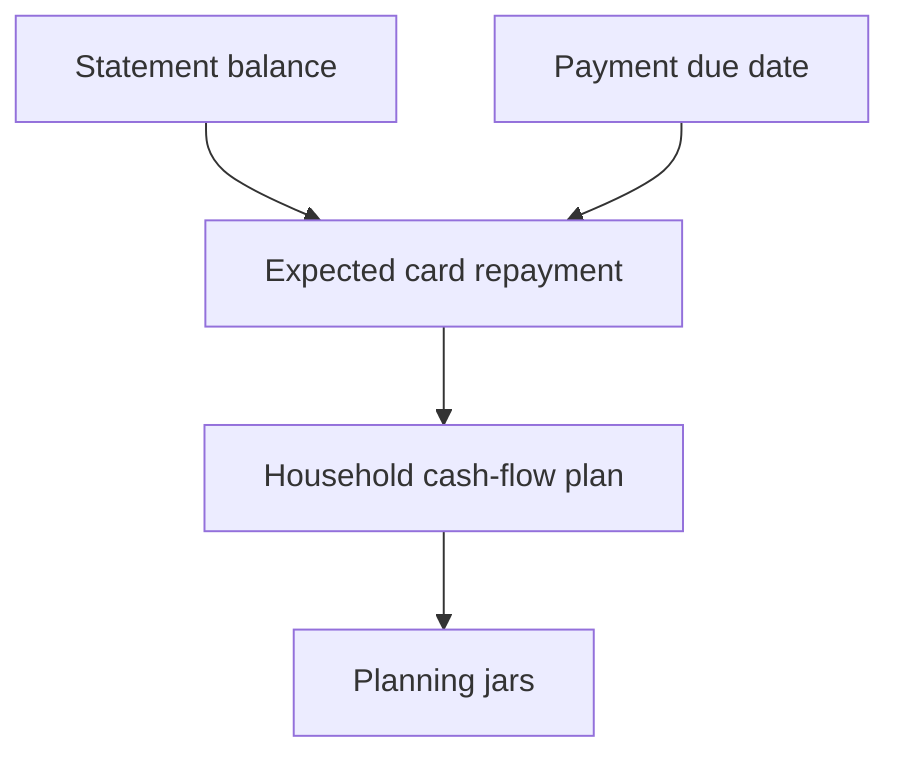
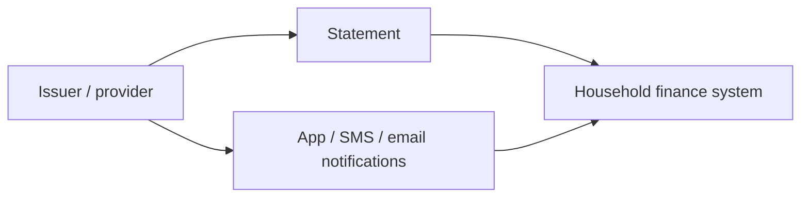

# Money Flow

## Real Money: Debit Card Purchase

Debit-card spending reduces real money in the linked payment account after authorization and settlement rules are applied.

## Real Money: Credit Card Purchase and Repayment

Credit-card spending creates an obligation first. Real household cash leaves later when the household repays the issuer.

## Real Money: Refund

A refund may reduce the current outstanding balance, appear as a credit, or affect a later statement depending on timing.

## Virtual Planning

Virtual planning does not move money. It forecasts the future bank-account outflow needed to settle card obligations.

## Read-Only Information

Read-only information informs the household record but is not itself proof that money has moved unless reconciled to provider records.
