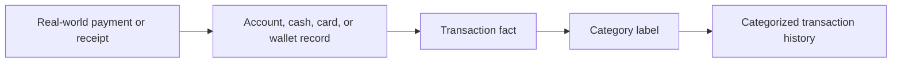
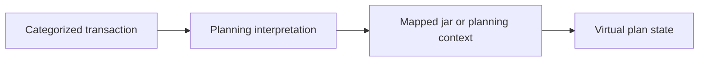
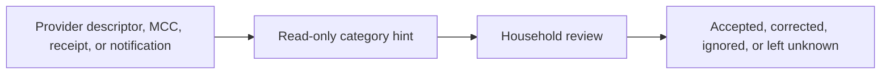

# Money Flow

Categories do not move money. They attach meaning to money facts. Keeping the flows separate prevents category labels from being mistaken for balances, budgets, or allocations.

## Real Money

Real money moves through accounts, cash, cards, wallets, providers, merchants, employers, or family members. Category assignment observes and labels the event.

Examples:

- Salary arrives and is categorized as salary income.
- A VietQR supermarket payment becomes a grocery or household expense.
- A pharmacy payment becomes health care.
- A family transfer may require careful classification as support, reimbursement, income, expense, or transfer.

## Virtual Planning

Categories can inform virtual planning, but they do not allocate money by themselves.

Examples:

- A food category may map to a food jar.
- A transport category may explain pressure on a transport plan.
- Category totals may help a household discuss future planning assumptions.

## Read-Only Information

External systems may provide category hints or merchant classifications. These are evidence, not household truth.

Examples:

- A card network classifies a merchant as restaurant.
- A wallet record shows a biller type.
- A receipt reveals that a supermarket purchase included baby supplies.
- A bank transfer note says "rent" or "mom".

## Boundary Statement

Categories describe money movement after or alongside the transaction fact. They do not execute payments, store balances, reserve cash, enforce spending limits, or settle obligations.
