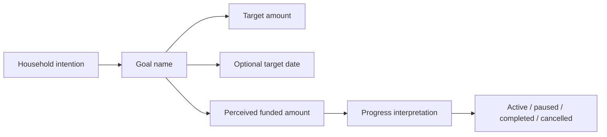
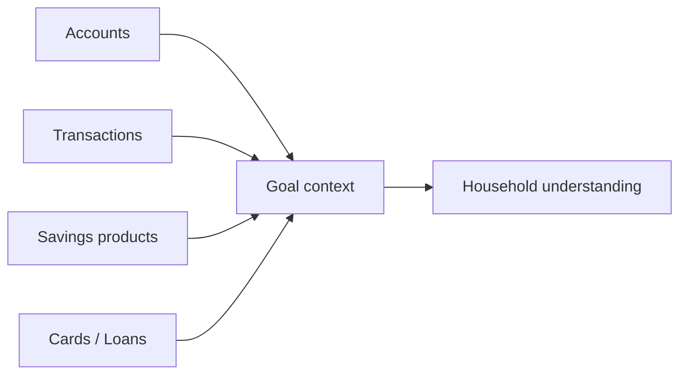

# Money Flow

Goals do not move money by themselves. Money moves in Accounts, Transactions, Savings, Cards, Loans, cash, or external providers. Goals interpret purpose and progress.

## Real Money

Real money flow belongs to money-holding and ledger domains.

## Virtual Planning

Virtual planning flow belongs to Goals and Planning. It expresses intention and interpretation, not provider-confirmed cash.

## Read-Only Information

Read-only information may inform confidence, affordability, or factual comparison. Ownership remains with the source domain.

## Important Separation

- A goal contribution can be an intention record without a bank transfer.
- A bank transfer can support a goal without the goal owning that transfer.
- A savings product can be associated with a goal without the goal owning product truth.
- Spending goal money is a real transaction or cash event, not a goal event by itself.
