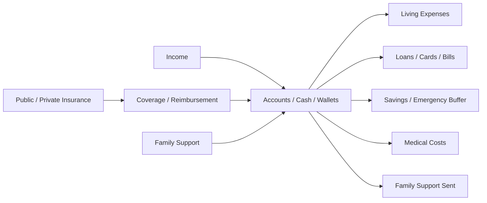
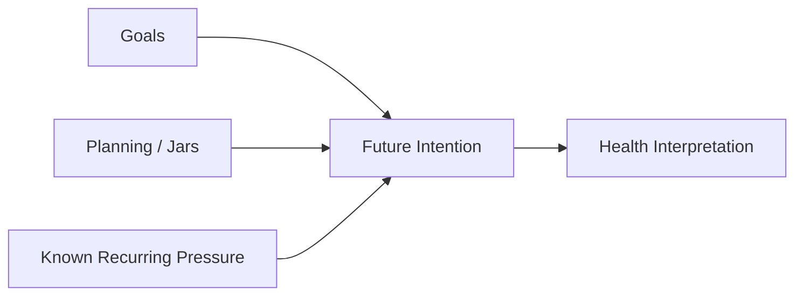
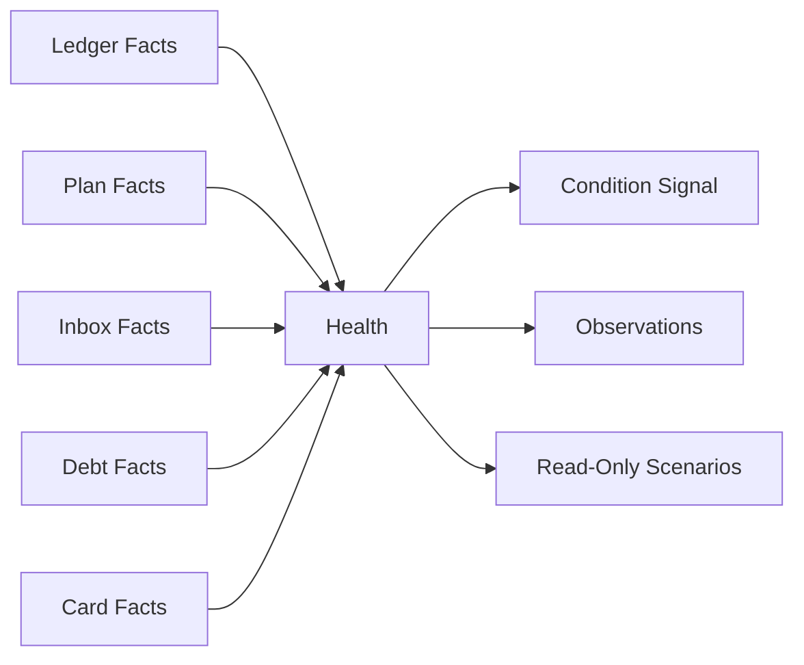

# Money Flow

Health does not own money. It observes money movement and interprets pressure.

## Real Money

Real money belongs to Accounts, Transactions, Cards, Loans, Savings, Insurance-related records, and external providers. Health reads the resulting condition.

## Virtual Planning

Virtual planning reflects intent and pressure. It is not bank balance and does not prove liquidity.

## Read-Only Information

Health creates interpretation only. It does not create, edit, delete, approve, transfer, repay, reconcile, or close financial records.
