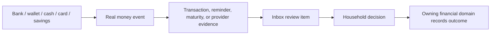
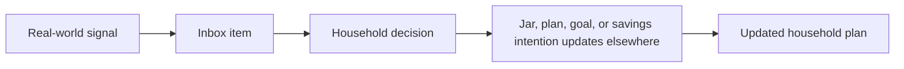
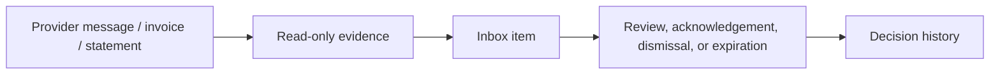

# Money Flow

Inbox has three different flow types. Keeping them separate is essential.

## Real Money

Real money moves outside Inbox. Inbox observes that a real-money event may require attention.

Examples:

- A VietQR payment creates a transaction that needs household categorization.
- A bank sends a savings maturity notice.
- A card issuer sends a payment reminder.
- A merchant refund appears and needs comparison with the original purchase.

## Virtual Planning

Virtual planning moves intention. Inbox may ask the household to decide how a fact affects that intention, but it does not hold money.

Examples:

- Choose which jar should absorb an expense.
- Acknowledge that a payment reminder affects upcoming cash capacity.
- Decide whether a matured savings product remains part of a goal.

## Read-Only Information

Inbox can contain read-only information that asks for awareness or review without moving money or planning allocation.

Examples:

- Provider reminder with due date.
- E-invoice evidence.
- Transaction notification awaiting confirmation.
- Imported statement item that needs context.

## Boundary Statement

Inbox does not execute payments, certify balances, own transactions, own savings terms, or allocate jars. It carries attention and decision state.
