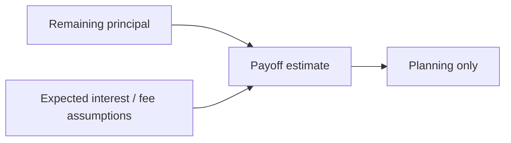

# Money Flow

## Real Money

Formal disbursement:

Merchant-financed purchase:

Scheduled repayment:

Informal family loan:

## Virtual Planning

Planned repayment schedule:

Projected payoff:

Virtual planning does not move money and does not prove lender confirmation.

## Read-Only Information

Provider statement:

Credit-history information:

Read-only information can be stale, delayed, partial, or formatted differently from household records.

