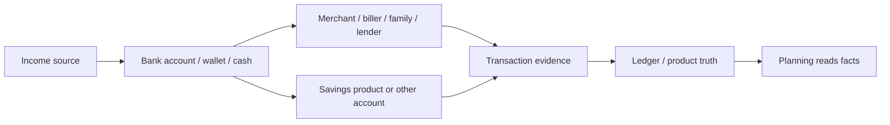
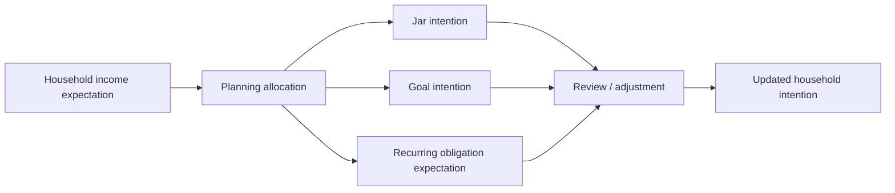
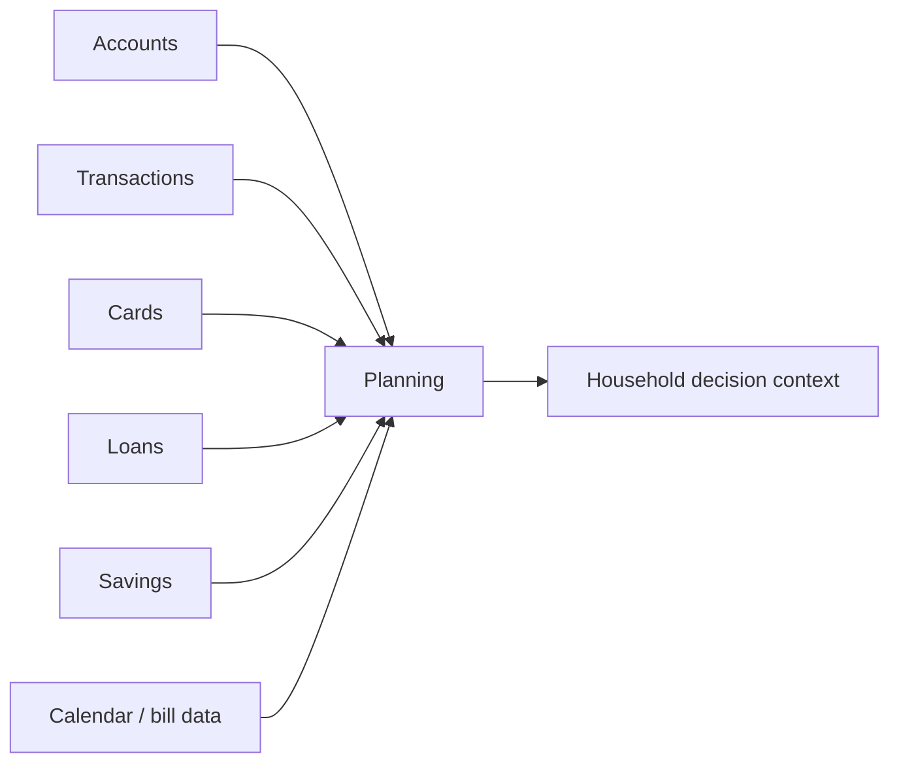

# Money Flow

Planning has three different flow types. Keeping them separate is essential.

## Real Money

Real money moves through accounts, cash, wallets, cards, savings products, and lenders. Planning may observe or react to this movement, but it does not execute or certify it.

Examples:

- Salary arrives in a bank account.
- Rent leaves through transfer.
- Groceries are paid by QR or cash.
- Loan repayment is paid from an account.
- Savings product is funded or settled.

## Virtual Planning

Virtual planning moves intention, capacity, priority, or expectation. It does not move real money.

Examples:

- Allocate part of salary to groceries.
- Mark a jar as paused.
- Track progress toward a baby fund.
- Reallocate planned capacity after an emergency.
- Approve the monthly review.

## Read-Only Information

Read-only information informs Planning without transferring ownership.

Examples:

- Account balance context.
- Recent spending evidence.
- Card due date.
- Loan due amount.
- Savings maturity date.
- Expected recurring bill.

## Boundary Statement

Planning can explain how money is meant to be used. It cannot prove where money is, certify that a payment happened, or turn a plan into a bank balance.
