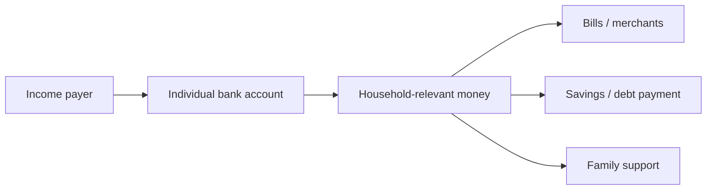
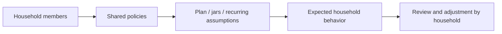
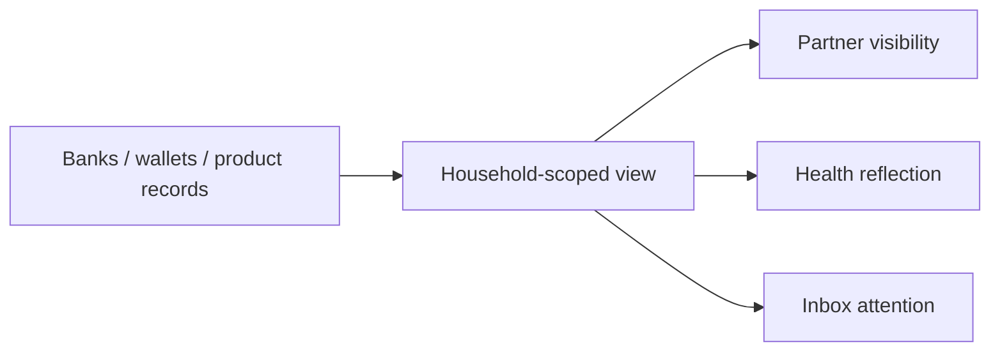

# Money Flow

Together does not move money by itself. It defines the people and policy context around money movement.

## Real Money

Real money moves through Accounts, Transactions, Cards, Savings, Loans, merchants, banks, and wallets.

Together's role in real money:

- Defines who can view the household-scoped record.
- Defines who is recognized as a member.
- Does not hold, transfer, allocate, or settle money.

## Virtual Planning

Virtual planning reflects agreed household intention. It is not money movement.

Together's role in virtual planning:

- Provides the shared policy context.
- Makes material assumption changes attributable and visible.
- Does not own jar balances, goals, recurring patterns, or month close facts.

## Read-Only Information

Read-only information helps household members understand what happened or what needs attention.

Together's role in read-only information:

- Determines household access boundary.
- Protects member-only visibility.
- Does not calculate financial health or decide meaning.

## No-Money Principle

Together is a collaboration domain, not a ledger domain.

It may affect who sees or approves household context. It must not be interpreted as a source of financial truth, a payment rail, or a balance owner.
