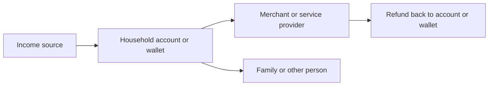
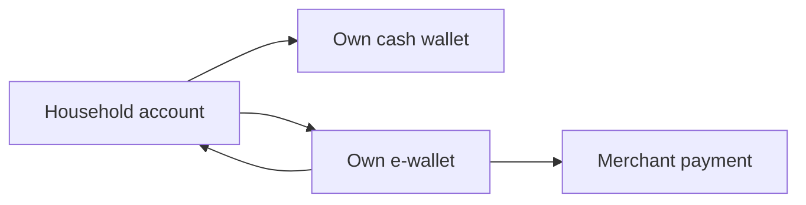
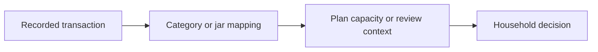

# Money Flow

## Real Money

Real money flow is movement recognized by a bank, wallet, card issuer, cash holder, merchant, employer, lender, or another person.

## Virtual Planning

Virtual planning uses transaction facts as inputs but does not itself move money.

Planning movement is not a transaction unless real money also moves.

## Read-Only Information

Read-only information describes activity without creating direct money movement inside the product.

Read-only information can be incomplete, delayed, duplicated, or corrected by the provider.
