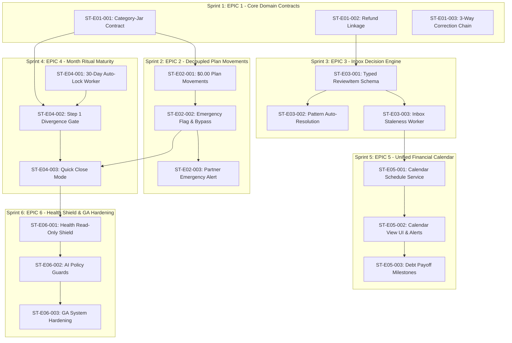

# Dependency Graph & Critical Path Analysis — ViNha

**Board:** Implementation Planning Board  
**Date:** 2026-08-03  
**Status:** APPROVED & FROZEN  
**Target Specification Version:** Specification v2.1  

---

## 1. Epic & Story Dependency Graph

---

## 2. Technical Bottleneck Analysis

1. **Category-Jar Contract (`ST-E01-001`)**: **Primary Critical Path Bottleneck**. All transaction posting, Month Ritual Step 1 divergence checks, and plan reallocations depend on the $N:1$ Category-Jar database constraint. Must complete in Sprint 1.
2. **Typed ReviewItem Schemas (`ST-E03-001`)**: **Inbox Bottleneck**. Auto-resolution policies, payment due reminders, and maturity alerts depend on typed schemas. Must complete early in Sprint 3.
3. **Month Lock Worker (`ST-E04-001`)**: **Ritual Bottleneck**. Auto-locking past months and auto-resolving stale items depend on this background worker. Must complete early in Sprint 4.
