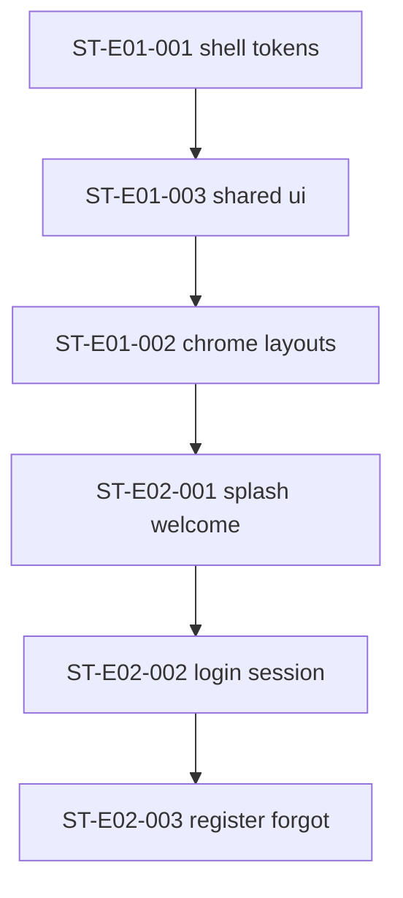

# Dependency Analysis — sprint-001

## Story dependency graph (linear)

**Cycles:** none. Graph is a single chain.

## External / foundation dependencies (already satisfied)

| Dependency | Status | Evidence |
|------------|--------|----------|
| Design System frozen | Ready | `artifacts/design-system/CURRENT` |
| Screen Blueprints auth | Ready | `artifacts/screen-blueprints/CURRENT/authentication/` |
| Developer Constitution | Ready | `artifacts/developer-constitution/CURRENT` |
| Technical Specification | Ready | `artifacts/technical-specification/CURRENT` |
| Bootstrap shell | Ready | `BOOTSTRAP_READY` |
| Localization routing / catalogs | Ready | `LOCALIZATION_READY`; `app/[locale]`; `messages/*` |
| Supabase SSR clients | Present | `modules/platform/supabase/` |

## Intra-story interface freezes

| Before | After |
|--------|-------|
| `shared/ui` inventory for auth | Auth form pages |
| Auth layout (no BottomNav) | Auth pages |
| Session provider / helpers | Gated product routes |
| Login working | Register/forgot polish links |

## Cross-sprint (out of this pack)

| Depends on S1 | Owned by later sprint |
|---------------|----------------------|
| Active household membership UX | S2 `ST-E03-001` onboard |
| Money capture | S3 |
| Plan / Inbox | S4 / S5 |

S1 only provides **fail-closed** membership gate for money mutations — not the onboard UI.

## Circular dependency check

| Check | Result |
|-------|--------|
| Story A ↔ Story B mutual wait | **None** |
| Layout ↔ pages | Auth layout before pages (ordered) |
| Session ↔ gates | Session helpers before gated routes (ordered within ST-E02-002) |
| UI ↔ i18n | Catalog keys before/with screens (same story, parallelizable after key list freeze) |
