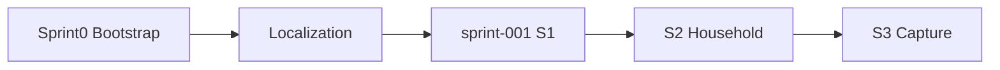

# Sprint Overview — sprint-001

## Identity

| Field | Value |
|-------|--------|
| Pack folder | `sprint-001` |
| Implementation Plan sprint | `S1` |
| Goal | Shell + Auth |
| Epics | `E01`, `E02` |
| Status | `READY_FOR_IMPLEMENTATION` |
| Exit criteria (SoT) | AppViewport + login session works |

Upstream: `artifacts/implementation-plan/CURRENT/sprints/S1.md`

## Detected repository state

| Signal | Evidence |
|--------|----------|
| Sprint 0 complete | `artifacts/LATEST_BOOTSTRAP.json` → `BOOTSTRAP_READY` |
| Localization complete | `artifacts/LATEST_LOCALIZATION.json` → `LOCALIZATION_READY` |
| Delivery sprints remaining | S1–S6 in Implementation Plan (S0 not in that pack) |
| **Current delivery sprint** | **S1 / sprint-001** |
| Auth UI | Absent — no splash/welcome/login/register routes under `app/[locale]` |
| Auth messages | `messages/en/auth.json` = `{}` |
| Product IA | `ProductStub` pages only (`home`, `money`, `plan`, `inbox`, `together`, `health`) |
| Domain modules | `modules/{ledger,plan,inbox,health,tenancy}` skeleton (README + gitkeeps) |
| Platform | `modules/platform/supabase/*` session refresh in `proxy.ts` (no auth gate) |
| DB migrations | `supabase/` empty — no rewrite migrations |
| Shell foundation | AppViewport, BottomNav, TopAppBar, `shared/ui`, tokens, next-intl — present |

## Progress / milestone / release

| Item | Value |
|------|--------|
| Completed | Sprint 0 Bootstrap; Localization Foundation |
| Current | sprint-001 (S1 Shell + Auth) — planning frozen; implementation not started by this board |
| Remaining delivery sprints | S2 Household → S3 Capture → S4 Plan → S5 Inbox → S6 Clarity |
| Milestone | MVP path (Implementation Plan S1–S6) |
| Release target | MVP: Auth, Together/Onboard, Home, Money, Plan, Inbox, Health basic (Phase 2 excluded) |

## Sequencing diagram

## Out of scope for this sprint

- S2–S6 stories
- E09 / Phase 2
- Money capture, Plan ritual, Inbox resolve domain logic
- Full onboarding wizard (`ST-E03-001`)
- Editing frozen SoT packs
