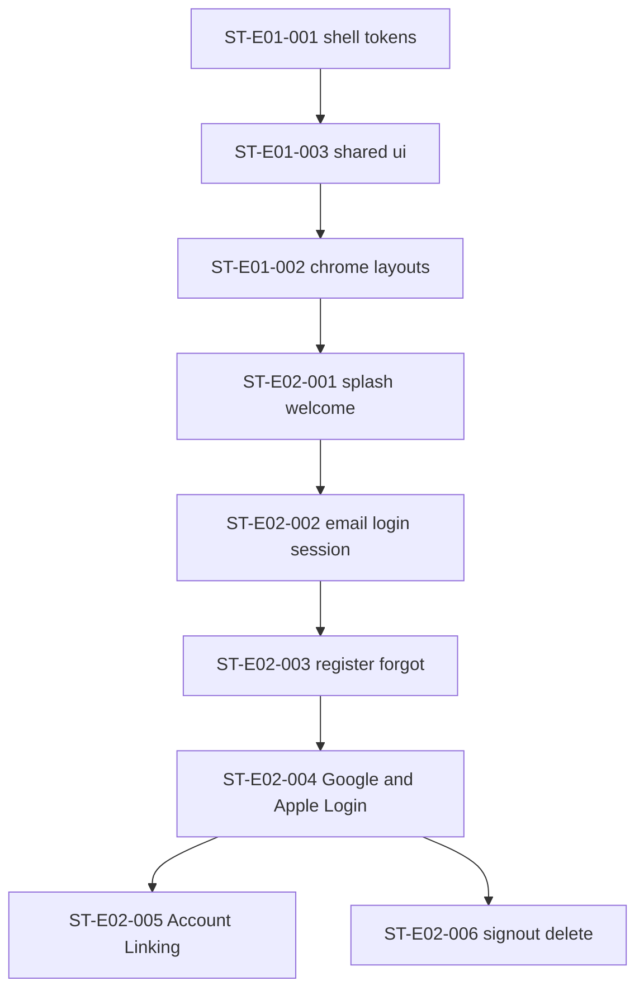

# Dependency Analysis — sprint-001

## Story dependency graph

**Cycles:** none.

## Capability dependencies

| Capability | Depends on | Story |
|------------|------------|-------|
| Google Login | Email session chrome + confirm adapter | `ST-E02-004` |
| Apple Login | Same as Google; Apple dashboard config | `ST-E02-004` |
| Account Linking | OAuth providers live; BR-02b policy | `ST-E02-005` |
| Sign-out / delete | OAuth or email session established | `ST-E02-006` |

## Intra-story interface freezes

| Before | After |
|--------|-------|
| Email login + confirm working | OAuth buttons + PKCE |
| Google + Apple Login working | Account Linking conflict UX |
| OAuth session working | Sign-out / delete |

## External dependencies

| Dependency | Status |
|------------|--------|
| Product / blueprints / tech Auth Strategy v2 | Adopted (CURRENT SoTs) |
| Design System / Pattern v1 | Ready |
| B-ENV-03 Google | Execution STOP until configured |
| B-ENV-04 Apple | Execution STOP until configured |
| B-ENV-05 Linking policy | Execution STOP until set for `ST-E02-005` |
