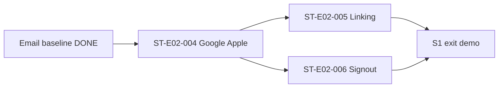

# Sprint Overview — sprint-001

## Identity

| Field | Value |
|-------|--------|
| Pack version | `v1.2.0` |
| Implementation Plan sprint | `S1` |
| Goal | Shell + Auth (including Authentication Strategy v2) |
| Epics | `E01`, `E02` |
| Status | `AUTH_READY_FOR_IMPLEMENTATION` |
| Exit criteria | AppViewport + login session works (email + OAuth-first Google/Apple) |
| Board run | `run_sprint_plan_auth_v2_20260802T015652Z` |

Upstream: `artifacts/implementation-plan/CURRENT/sprints/S1.md` · Auth SoT: product/tech/blueprints v2.1.0 / v1.1.0

## Detected repository state

| Signal | Evidence |
|--------|----------|
| Email auth baseline | `ST-E02-001`…`003` frozen in sprint-execution |
| Auth UI | Splash, welcome, login, register, forgot, confirm present |
| OAuth UI / commands | **Not started** — residual `ST-E02-004`…`006` |
| Auth Strategy v2 SoT | Adopted; change log `artifacts/change-log/authentication-v2-adoption.md` |
| Shell / i18n foundation | Present |

## Progress

| Item | Value |
|------|--------|
| Completed | Sprint 0; Localization; S1 email baseline stories |
| Current | Residual Auth Strategy v2 — **next `ST-E02-004`** (Google + Apple Login) |
| Remaining in S1 | Account Linking (`ST-E02-005`); Sign-out/delete (`ST-E02-006`) |
| After S1 | S2 Household / Onboard |

## Sequencing

