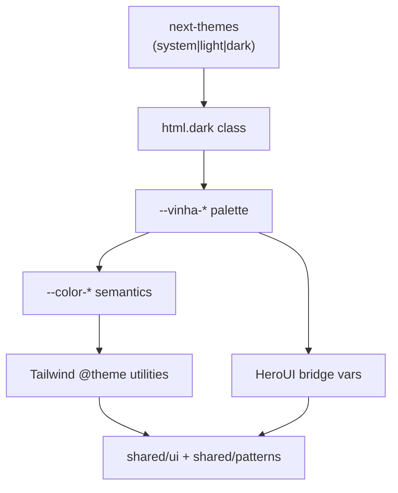

# Theme Architecture

## Goal

One semantic token layer drives every visual surface. Light and Dark are equal first-class themes — Dark is never a special-case override in components.

## Stack

## Rules

1. **Canonical palette** lives on `--vinha-*` in `:root` and `.dark` / `[data-theme="dark"]`.
2. **Semantic aliases** `--color-*` always point at `--vinha-*` — components and Tailwind consume `--color-*` / utilities (`bg-surface`, `text-text-primary`, `bg-accent`).
3. **HeroUI** inherits via bridge vars (`--background`, `--accent`, `--field-placeholder`, …) remapped to the same palette — no second HeroUI theme object.
4. **No hardcoded hex** in product UI. Exception: third-party brand glyph fills (Google logo paths) documented in [migration-summary.md](./migration-summary.md).
5. **Page theme lock** — theme applies to outer canvas + AppViewport together; no mid-scroll section flips ([Theme-Tokens.md](../../design-foundation/CURRENT/Theme-Tokens.md)).
6. **Class dark variant** — `@custom-variant dark (&:where(.dark, .dark *));` so any residual `dark:` utilities track `next-themes`, not OS media alone.

## Persistence & hydration

- Storage key: `vinha-theme`
- Default: `system`
- `suppressHydrationWarning` on `<html>`
- ThemeToggle mounts inert until client hydration (no mismatch)
- FOUC prevented by `next-themes` inline bootstrap script + `disableTransitionOnChange` on hydrate; intentional switches use a 200ms `.theme-transitioning` fade

## Future components

Any new component must:

1. Use semantic token classes or `var(--color-*)`
2. Avoid `dark:` forks unless truly necessary (prefer token swaps)
3. Use `getChartPalette()` for Recharts / canvas ink
