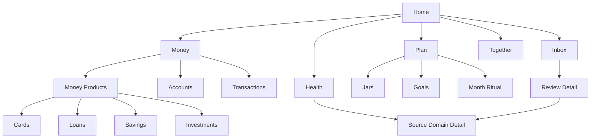

# Critical Journey Inventory

## Journey Groups

| Group | Journeys covered |
|---|---|
| Onboarding and Household | Register, Login, OAuth callback, Create household, Join household, Invite partner, Accept invitation, Switch/leave household, Profile/preferences |
| Daily Money | View real position, Create income, Create expense, Transfer, Search transactions, Transaction detail, Refund, Correct |
| Accounts | Create account, Opening balance, Edit account, Archive account, Recent activity |
| Cards | Create card, Card status, Statement/due date, Record payment, Installment review |
| Loans | Create loan, Compare repayment methods, Schedule preview, Record payment, Pay early, Update future interest, Complete/archive |
| Savings | Create contract, Fund from account, Active cycle, Maturity, Renew, Change package, Withdraw at maturity, Early withdrawal preview/confirm |
| Investments | Create holding, Record buy, Record sell, Record dividend/income, Update valuation, Review realized/unrealized performance |
| Planning | Jars, Monthly intention, Reallocate capacity, Divergence, Month Ritual |
| Goals | Create goal, Connect approved funding behavior, Progress, Complete/pause/archive |
| Inbox | Review typed item, Resolve item, Batch eligible items, Delegate eligible decision, Recover stale decisions |
| Together | Invite member, Review roles, Shared action, Audit/change understanding |
| Health | Review health, Understand factors, Navigate to source, Read-only enforcement |

## Flow Map

## Priority Journeys

P0 before redevelopment:

- Register/login/create household.
- Day-0 Home setup.
- Create income/expense/transfer.
- Transaction refund/correction.
- Savings maturity and early withdrawal.
- Loan payment and early payoff.
- Inbox typed review resolution.
- Health read-only source navigation.
- Investment sell/write-off/valuation clarity where investment surfaces are in scope.

P1 during redevelopment:

- Advanced loan setup.
- Card statement/payment flows.
- Investment holding setup and valuation update.
- Month Ritual completion.
- Cross-module return preservation.
- Household preferences/policies.

P2 polish:

- Microcopy refinements.
- Motion tied to completion.
- Advanced empty-state coaching.

